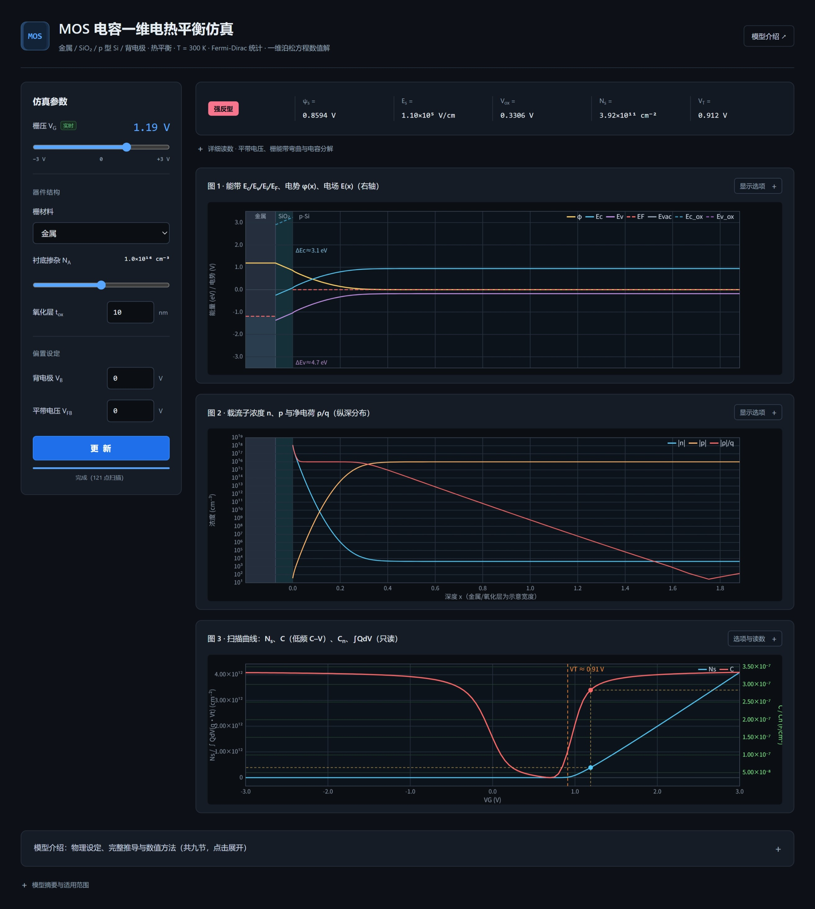
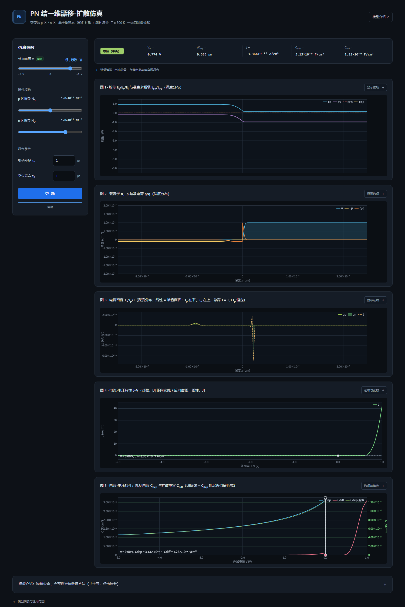

# 半导体器件一维数值仿真（MOS 电容 + PN 结）

两个**零依赖、单文件**的交互式网页仿真，覆盖半导体器件物理中最基础的两个一维结构：

- **MOS 电容**（`mos.html`）——热平衡态，Fermi-Dirac 统计 + 一维泊松方程数值解
- **PN 结**（`pn.html`）——非平衡稳态，漂移-扩散 + SRH 复合，全耦合牛顿迭代

无需构建、无需服务器：用现代浏览器直接打开 HTML 文件即可（支持 `file://`，离线可用）。

| 页面截图 | 说明 |
|---|---|
|  | MOS 电容：能带图 / 载流子分布 / C–V 扫描曲线 |
|  | PN 结：能带与准费米能级 / 载流子 / 电流密度 / J–V / C–V |

## 目录结构

| 文件 | 说明 |
|---|---|
| `mos.html` | MOS 电容一维电热平衡仿真（完整页面，公式已内联为 SVG） |
| `model-doc-mos.tex` | MOS 模型介绍面板的公式唯一源文稿（可独立 xelatex 编译，九节推导） |
| `pn.html` | PN 结一维漂移-扩散仿真 |
| `model-doc-pn.tex` | PN 模型介绍面板的公式唯一源文稿（十节推导） |
| `screenshots/` | 页面截图 |
| `README.md` | 本文件 |

> 命名说明：MOS 页面曾用名 `index.html`（现 `mos.html`）、文稿曾用名 `model-doc.tex`（现 `model-doc-mos.tex`），两页命名现已对齐 `*-mos` / `*-pn` 约定。

## 快速开始

1. 双击（或用浏览器打开）`mos.html` 或 `pn.html`；
2. 页面加载后自动完成一次全扫描（进度条显示，可点击"更新"中止并按最新参数重启）；
3. 拖动电压滑块实时观看求解结果；其余参数改动后点"更新"生效。

推荐 Chromium 系浏览器（Chrome / Edge）的桌面端窗口（宽 ≥ 781px 可获得最佳布局，左栏与读数条滚动时固定）。

## MOS 电容页（mos.html）

**物理模型**：金属 / SiO₂ / p 型 Si / 背电极；热平衡（半导体内单一费米能级）；经典 Fermi-Dirac 统计（F₁/₂、F₋₁/₂ 启动建表 4096 点，表外 Boltzmann / Sommerfeld 渐近）；一维泊松方程阻尼牛顿 + 三对角 Thomas 求解。

**参数**：栅压 V_G（实时滑块，−3 ~ +3 V）、栅材料（金属 / n+ / p+ 多晶硅，多晶侧自动计算内建 Φ_ms 与栅耗尽）、多晶掺杂 N_g、衬底掺杂 N_A、氧化层 t_ox、背压 V_B、平带电压 V_FB。

**图表**：

1. **能带图**：E_c/E_v/E_i/E_F、电势 φ(x) 与电场 E(x)（右轴）；金属/氧化层为固定宽度示意块（金属电子海填充、氧化层带边、ΔE_c/ΔE_v 界面标注）；"完整带隙"开关可扩窗看全氧化层 9 eV 带隙
2. **载流子分布**：n、p、净电荷 ρ/q（对数默认；线性模式纵轴封顶 2×N_A 并提示裁剪）
3. **扫描曲线**：N_s、低频 C–V 电容 C、电子电容 C_n、Pao-Sah 归一化积分 ∫QdV（双轴，线性默认；V_T 竖线；当前 V_G 十字准线 + 角部读数）

**读数**：工作区徽章（积累/平带/耗尽/弱反型/强反型）、ψ_s、E_s、V_ox、N_s、V_T；折叠详情含 V_FB,eff / Φ_ms / 栅弯曲 ψ_g / 电容串联分解。

## PN 结页（pn.html）

**物理模型**：一维突变结；漂移-扩散方程（Scharfetter-Gummel 离散）+ 单能级 SRH 复合；平衡态 Gummel 迭代，偏压下泊松 + 双连续性方程全耦合牛顿（3×3 块三对角、比例阻尼、电压延拓）。

**参数**：外加电压 V（实时滑块，−5 ~ +1 V）、p 区掺杂 N_A、n 区掺杂 N_D、电子/空穴寿命 τ_n / τ_p。

**图表**：

1. **能带与准费米能级**：E_c/E_v/E_i + E_Fn/E_Fp（耗尽区着色、p/n 区标注）
2. **载流子分布**：n、p、净电荷 ρ/q（线性默认，纵轴封顶 ±2×max(N_A,N_D)；可切对数）
3. **电流密度**：J_n / J_p / J（**线性默认，堆叠面积图**——J_p 在下、J_n 在上，总高 J = J_n + J_p 恒定；悬停显示各带贡献）
4. **J–V 特性**（线性默认；对数模式分正向/反向）
5. **C–V 特性**：耗尽电容 C_dep、扩散电容 C_diff 与耗尽近似解析式（**线性默认"劈开轴"**：拖动竖直分割线调节左右两侧小/大量程的分界电压 V_split，两端圆手柄可拖、双击复位；每侧量程按本区曲线最大值自适应；对数模式为单一共享 log 轴）

**读数**：工作区徽章（反偏/零偏/正偏·弱注入/强注入）、V_bi、W_dep、J、C_dep、C_diff；折叠详情含两端扩散电流分量、存储电荷、势垒区峰值复合率等。

## 两页共同的 UI 特性

- **深色主题**，1480px 居中；响应式断点（1260 / 1080 / 780 / 460 px）
- 左侧参数面板 + 右侧图列；**宽 ≥ 781px 时参数面板与读数条滚动固定**（面板超高时内部滚动）
- 每图右上角"显示选项"折叠条：曲线开关、线性/对数切换、当前点读数
- 通用绘图类：双纵轴、对数轴、填充/堆叠面积、图例、鼠标悬停十字线 + 插值读数 tooltip
- **双通道交互**：电压滑块为实时通道（rAF 节流单点求解）；其余参数为缓更新通道（改动后显示橙色"未生效"角标，点"更新"后分片异步全扫描）
- 可访问性：aria 标签、键盘焦点环、`prefers-reduced-motion` 适配

## 模型文档的维护（tex ↔ 页面面板）

两个 `.tex` 文件是页面"模型介绍"面板的**公式唯一源**（面板文字与 tex 需同步修改）。修改/新增公式后：

1. 编辑对应的 `.tex`（保持 `% [eq:名字]` 标签全局唯一）；
2. 在临时工作区安装 `mathjax@3`，用 `tex2svg` 把公式渲染为 SVG；
3. 把 SVG 内部 `id` 前缀替换为本页专属前缀后注入 HTML 的 `<!-- MODEL-DOC-BEGIN --> … <!-- MODEL-DOC-END -->` 段：
   - MOS 页前缀：`MJX-`（增量批次 `MJXT-`、`MJXTB-`，下一批 `MJXTC-` 顺延）
   - PN 页前缀：`MJXPN-`
4. 完整流程见两个 `.tex` 文件头部注释。

## 数值方法速览

| | MOS（mos.html） | PN（pn.html） |
|---|---|---|
| 主方程 | 1D 泊松（非线性） | 泊松 + 电子/空穴连续性 |
| 离散/求解 | 非均匀网格 + 阻尼牛顿 + Thomas 三对角 | Scharfetter-Gummel + 全耦合牛顿（块三对角） |
| 统计 | Fermi-Dirac F_±1/2（4096 点查表） | Boltzmann（非简并） |
| 栅/结边界 | 金属 Robin 或多晶三层双 Dirichlet | 欧姆接触，φ_n=φ_p=0/V |
| 扫描 | −3 ~ +3 V，121 点 warm-start，分片异步 | −5 ~ +1 V，电压延拓 + 自适应二分 |
| 后处理 | 微分电容中心差分 + 5 点平滑、Pao-Sah 积分、V_T 插值 | C_dep/C_diff 中心差分 + 5 点平滑、终端电流全边平均 |

## 适用范围与已知简化

- **MOS**：热平衡假设（无深耗尽）、忽略量子限域（二维电子气）、界面态与 Q_f 打包进 V_FB、无隧穿漏电流；t_ox 极薄或强场下为纯数学解
- **PN**：非简并（≤1e18）、恒定迁移率、仅 SRH 复合、无雪崩/隧穿/串联电阻、准静态电容定义

详细推导与失效场景见两个页面内的"模型介绍"（九节 / 十节）与页脚摘要。
